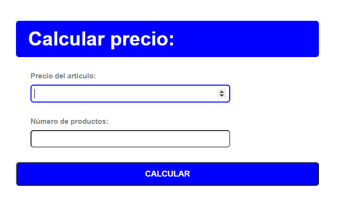

# EJERCICIO PROGRAMACIÓN PHP - CURSO DESARROLLO DE SOFTWARE LIBRE

## Descripción

## 1º vista con formulario en el cual se recogen los datos del precio del artículo y el número de productos, al pulsar calcular se redirige a una segunda vista:
