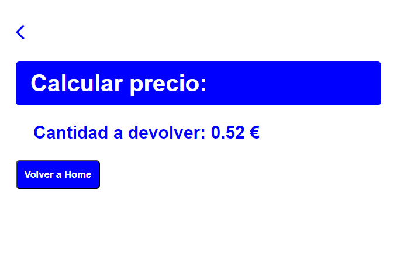

# EJERCICIO PROGRAMACIÓN PHP - CURSO DESARROLLO DE SOFTWARE LIBRE

## Repositorio https://github.com/cferreirobelenguer/ejercicioPhp
## Descripción

## 1º vista con formulario en el cual se recogen los datos del precio del artículo y el número de productos, al pulsar calcular se redirige a una segunda vista:

## Se realiza una validación mediante javascript en la que no se permita que los datos sean negativos o igual a 0, en caso de ser así no se redirige a la siguiente vista y se muestra mensaje de error.

## En la siguiente vista se muestra el precio  incluido el IVA y se pide al usuario que introduzca la cantidad a pagar, si se pulsa a calcular cantidad a devolver pasa a una nueva vista.

## Si la cantidad a pagar es mayor que el importe sale la cantidad a devolver.

## Si la cantidad a pagar es menor que el importe sale la cantidad a deber.

## Los iconos de flecha en todas las vistas permiten ir a la vista principal de home.